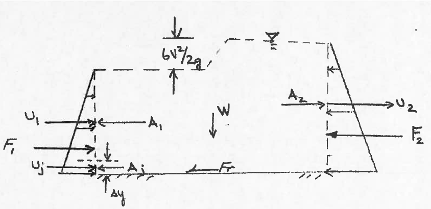

# How to make an ordinary homework problem into a computational thinking exercise - Fluid Mechanics


## Prerequesites (for this example)

- Students will have completed ENGR-1330; CE 2301; and be enrolled in CE 3305
- Students (by virtue of ENGR-1330) will have functioning implementations of JupyterLab

## Methodology for Problem (and Solution)
- Present problem verbatim from usual source, i.e. textbook

- Review main principles of CT :

    1. Algorithm - A list of steps that you can follow to finish a task
    2. Decomposition - Break a problem down into smaller pieces
    3. Abstraction - Pulling out specific differences to make one solution work for multiple problems
    4. Pattern Matching - Finding similarities between things
    
- CT Problem Solving Protocol (from ENGR-1330)

    1. Explicitly state the problem
    2. State:
      - Input information
      - Governing equations or principles, and 
      - The required output information.
    3. Work a sample problem by-hand for testing the general solution.
    4. Develop a general solution method (coding).
    5. Test the general solution against the by-hand example, then apply to the real problem.
    
- Start the problem/solution example; explicitly identify CT principles as problem proceedes.

- Choose meaningful problems


# Problem Statement (Cite Source)

Jet-type pumps are often used for special applications, such as to circulate the flow in basins in which fish are farmed.  The use of a jet-pump reduces mechanical injury to the fish. 

Figures 1 and 2 show the basic concept for this application of a jet pump.  


|Figure 1|Plan View of a fish race||
|:---|:---|---:|


|Figure 2|Elevation detail of a fish race jet pump||
|:---|:---|---:|

For this type of basin the jets would have to increase the water surface elevation by an amount equal to $\frac{6V^2}{2g}$, where $V$ is the average velocity in the basin ( $1~\frac{ft}{s}$ as shown in the figures).  Propose a basic design for a jet system that would make such a recirculating system work for a channel $8$ ft wide and $4$ ft deep. That is determine the nozzle diameter, speed, and number of nozzles. The design should specify nominal diameters of nozzles using commercially available pipes (1-in., 2-in, ...).  How do the specifications change if the desired water depth is to be $6$ feet deep (to accomodate more fish)  

***Hint*** This problem involves "analysis" to determine the required momentum added by the jets and the total jet area and speed The design should be based on this analysis with an understanding that the total jet area should be small as compared to the total flow area (otherwise the fish could get stuck!).

## Problem Solving Protocol
Recall the problem solving protocols in ENGR-1330 [ENGR-1330-S2021-Cleveland](http://54.243.252.9/engr1330content/engr-1330-webroot/1-Lessons/Lesson01/OriginalPowerpoint/ENGR-1330-Lesson1.html)

1. Define the problem (problem statement)
2. Gather information (identify known and unknown values, and governing equations)
3. Generate and evaluate potential solutions
4. Refine and implement a solution
5. Verify and test the solution.

We can stipulate that Step 1 is already done, 

### Known Values:
- Geometry
- Liquid (Water) ( if we need properties we can get them from [Water Properties Database](http://theodore-odroid.ttu.edu/documents/toolbox/fluidmechanics/WaterPropertiesUS/WaterPropertiesUS.html), or something similar

### Unknown Values
- Jet diameter
- Jet speed
- Jet count (number of jets)

### Governing Principles
These are going to be problem and discipline specific; in this case conservation of mass and momentum are going to be required.  

## Abstraction -- The Control Volume Diagram
At this point we are mostly trying to develop an algorithm, but are already about to apply **abstraction** when we create a Control-Volume Diagram of the mixing zone depicted in Figure 2.



|Figure 3|Control Volume Diagram of Mixing Zone||
|:---|:---|---:|

Examining the diagram, we will further abstract by defining variables for our problem:


\begin{gather} 
\begin{aligned}
& F_1 == \text{Pressure force on approach face of mixing zone   } \\
& F_2 == \text{Pressure force on exit face of mixing zone       } \\
& u_1 == \text{Free stream speed on approach face of mixing zone} \\
& u_2 == \text{Free stream speed on exit face of mixing zone    } \\
& u_j == \text{Jet stream speed in mixing zone                  } \\
& A_1 == \text{Free stream area of approach face of mixing zone } \\
& A_2 == \text{Free stream ares of exit face of mixing zone     } \\
& A_j == \text{Jet stream speed in mixing zone                  } \\
\end{aligned}
\end{gather}

## Decomposition - Continunity Analysis

Recall the continunity result from the Reynolds Transport Theorem:

$0 = \frac{\partial}{\partial t}\int_{CV}  \rho dV + \int_{CS} \rho(V \cdot dA) $

Substitute the geometry from the problem conditions into the flux integral (the volume integral  vanishes because we are considering steady flow) as

$0 = \rho u_2 A_2 - \rho u_1 A_1 - \rho u_j A_j $ where 

$~~~~~A_1 = W \cdot (y_1 - \Delta y)$

$~~~~~A_2 = W \cdot (y_2)$

$~~~~~A_j = W \cdot (\Delta y)$

$~~~~~W = \text{width of channel} $

Notice that if the channel is a constant width, and we stipulate that the liquid is incompressible so that the density is some constant, we can factor these out to obtain

$0= u_2  \cdot (y_2) - u_1  \cdot (y_1 - \Delta y) - u_j  \cdot (\Delta y)$

Rewrite in terms of $u_2$ as:

$u_2  \cdot (y_2) = u_1  \cdot (y_1 - \Delta y) + u_j  \cdot (\Delta y)$

Divide by $y_2$ to obtain $u_2$ (which we will substitute into momentum shortly!)


$u_2   = \frac{u_1  \cdot (y_1 - \Delta y) + u_j  \cdot (\Delta y)}{y_2}$

## Decomposition - Momentum Analysis

Recall the momentum result from the Reynolds Transport Theorem:

$\sum F_x = \frac{\partial}{\partial t}\int_{CV} V \rho dV + \int_{CS} V\rho(V \cdot dA) $

Consider force diffference:

$F_1 - F_2 = -u_j~\rho~u_j A_j - u_1 \rho u_1 A_1 + u_2 \rho u_2 A_2$ where 

$~~~~~A_1 = W \cdot (y_1 - \Delta y)$

$~~~~~A_2 = W \cdot (y_2)$

$~~~~~A_j = W \cdot (\Delta y)$

$~~~~~W = \text{width of channel} $

Stipulate hydrostatic pressure forces at upstream and downstream faces

$F_1 = \rho g \frac{y_1}{2} y_1 W$

$F_2 = \rho g \frac{y_2}{2} y_2 W$

Now substitute into the momentum balance for the control volume

$\rho g W (\frac{y_1^2}{2} - \frac{y_2^2}{2}) = -u_j~\rho~u_j W \cdot (\Delta y) - u_1 \rho u_1 W \cdot (y_1 - \Delta y) + u_2 \rho u_2 W \cdot (y_2)$

Notice that if the channel is a constant width, and we stipulate that the liquid is incompressible so that the density is some constant, we can factor these out to obtain

$ g  (\frac{y_1^2}{2} - \frac{y_2^2}{2}) = -u_j~u_j  \cdot (\Delta y) - u_1  u_1  \cdot (y_1 - \Delta y) + u_2  u_2  \cdot (y_2)$

Now arrange momentum in terms of the jet as

$ u_j^2 ~\Delta y = - u_1^2(y_1 - ~ \Delta y) + u_2^2~y_2 - \frac{g}{2}(y_1^2 - y_2^2)$

Substitute $u_2$ from continunity

$ u_j^2 ~\Delta y = - u_1^2(y_1 - ~ \Delta y) + [\frac{ u_1~(y_1 - ~ \Delta y) - u_j ~\Delta y}{y_2}]^2~y_2 - \frac{g}{2}[y_1^2 - y_2^2]$

This equation is our model, it is implicit in $ u_j^2 ~\Delta y$, hence almost requires a computational approach to find a solution.  

As a first step, lets try a predictor-correction approach - that is we will simply guess values for cetrain unknowns, and see how close we can make thw two sides of the model agree.

## Algorithm (Initial Steps)

### Rudimentary Guess-Check Approach

- Verify what we know about the problem:
    1. $u_1 = 1 \text{ft/sec  (given)}$
    2. $y_1 = 4 \text{ft (given)}$
    3. $y_2 = 4 + \frac{6(1)^2}{2(32.2)} = 4.0932 \text{ft  (indirectly given)}$
    4. $u_2 = f(u_j,\Delta y) \text{ (model equation)}$
    5. $u_j = \text{unknown}$
    6. $\Delta y = \text{unknown}$
    7. $g = 32.2 \text{ft/sec/sec  (given)}$

Keep in mind that $\Delta y$ is proportional to the jet area, and the jets are small (unless we want to make our facility into a Bass-o-Matic [youtube-link-bassomatic](https://www.youtube.com/watch?v=c06HorsmhjY)

We will rearrange our model equation above, by dividing by $\Delta y$ 

$ u_j^2  = \frac{- u_1^2(y_1 - ~ \Delta y) + [\frac{ u_1~(y_1 - ~ \Delta y) - u_j ~\Delta y}{y_2}]^2~y_2 - \frac{g}{2}[y_1^2 - y_2^2]}{\Delta y}$

Then gather all the terms involving $u_j$ onto the left hand side as

$ u_j^2 - \frac{u_j^2 \Delta y}{y_2} + \frac{2 u_1 (y_1 - \Delta y)}{y_2} = \frac{- u_1^2(y_1 - ~ \Delta y)}{\Delta y} + \frac{u_1^2 (y_1 - \Delta y)^2}{y_2 \Delta y} - \frac{g}{2 \Delta y}[y_1^2 - y_2^2]$

Now we are ready for computation - if we "pick" $\Delta y$ the only unknown is $u_j$; therefore solvable. If we make a set of guesses, we can compute required jet speed and jet total area.

First some preliminary coding, to use different jet speeds for a given $\Delta y$

```python
dy = 0.1 #delta y 
width = 8.0
grav = 32.2 # gravitational acceleration constant (US Customary Units)
u1 = 1.0 #free stream approach
y1 = 4.0 #approach depth
y2 = y1 + 6.0*(u1**2)/(2.0*grav) #exit depth as velocity head
```


```python
rhs = -u1*u1*(y1-dy)/dy + (u1*u1*(y1-dy)**2)/(y2*dy) - grav*(y1**2-y2**2)/(2*dy)
```


```python
for i in range(1,200):
    uj = float(i)*0.1
    lhs = uj**2*(1-dy/y2) + 2*u1*(y1-dy)*uj/y2
    if abs(lhs-rhs) <=2: #only print when close
        print('uj = ',round(uj,2),'LHS = ',round(lhs,2),'RHS = ',round(rhs,2))
```

    uj =  10.1 LHS =  118.76 RHS =  119.56
    uj =  10.2 LHS =  120.94 RHS =  119.56


So for a $\Delta y$ of 0.1, the required jet speed is somewhere around 10.1 feet per second.  Now we need to determine the total jet area, and nominal sizes.  


```python
areajet = dy*width
import math
def howManyJets(jetarea,diameter):
    perjet = 0.25*math.pi*diameter**2
    if jetarea%perjet == 0:
        howManyJets = jetarea/perjet
    elif jetarea%perjet != 0:
        howManyJets = jetarea//perjet + 1
    return howManyJets

inches = 1/12
howManyJets(areajet,inches)
```


    147.0


So for $\Delta y$ of 0.1 we will need 147 1-inch diameter jets.  The next step is to refine and generalize our solution so we can explore different speeds - for example a 10 ft/sec jet will probably skin a fish, not healthy for our application.

For refinement, lets improve the precision of the jet speed calculation (i.e. automate the matching of lhs and rhs)

## Algorithm (Refinement) 

### Semi-Automated, Quasi-Newton,Approach

```python

```


[Link to the JupyterLab notebook directory for this example](#)